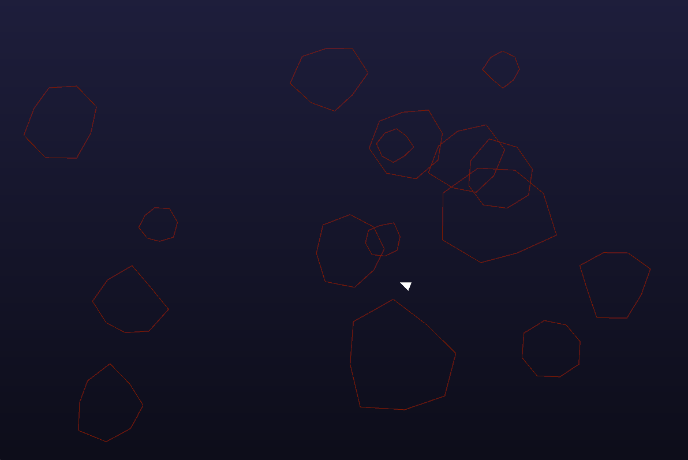

# Rasteroid

## Overview

**Rasteroid** is an unpolished clone of the classic Asteroids game, created as a personal learning project to explore the graphics pipeline, implement post processing effects (like camera shake), and take initial steps into data-oriented design (DOD).

## Limitations

- No animations
- Dash can sometimes be spammed
- No score system
- No visible life indicator
- Splitting into multiple smaller chunks is not intuitive when it happens visually

## Getting Started

1. Clone the repository.
2. In the root directory, run `cargo run` or `cargo run --release`.
3. WASD and Mouse to control the ship, Mouse Buttons to shoot.

## Possible Improvements

- Implement a proper cooldown system for the dash ability
- Introduce a scoring system and a visual life indicator
- Improve the asteroid splitting effect for better clarity
- Game over screen and start screen with keyboard controls
